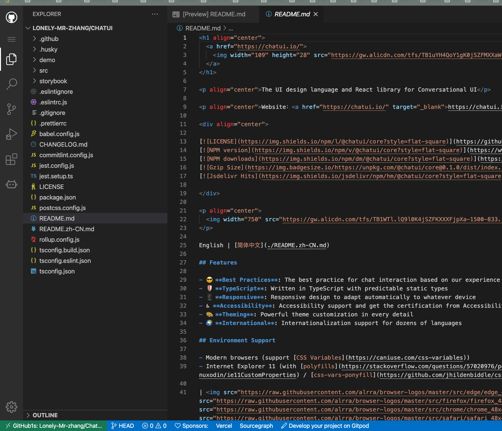

# github_1s_vscode
github1s Google Chrome Extensions

## 了解
[github1s – 为 GitHub +1s，使用在线 VS Code 打开 GitHub 上的代码](https://www.appinn.com/github1s/)

## 安装
- git clone git@github.com:Lonely-Mr-zhang/github_1s_vscode.git
- [谷歌chrome浏览器加载安装解压的扩展程序的方法](http://www.win7zhijia.cn/jiaocheng/win7_41490.html)

## 使用
- 访问 github 仓库，会在页面左边出现 github_1s_vscode 按钮，点击该按钮就可跳转至当前访问仓库的GitHub1s在线vscode页面

